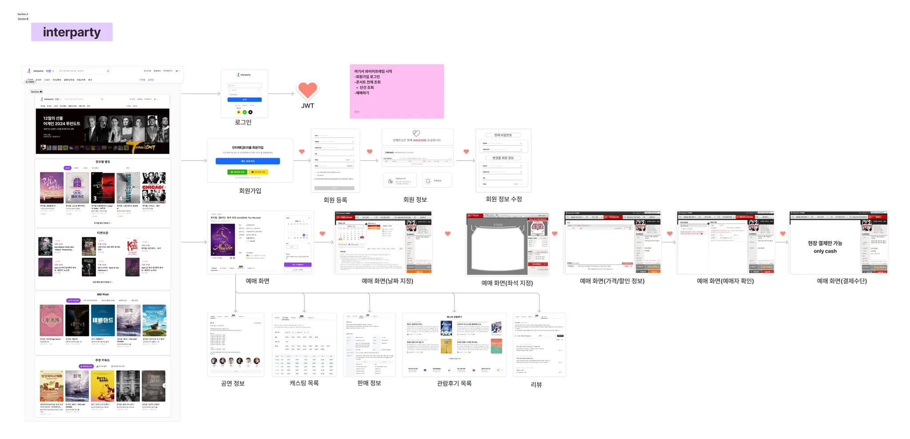
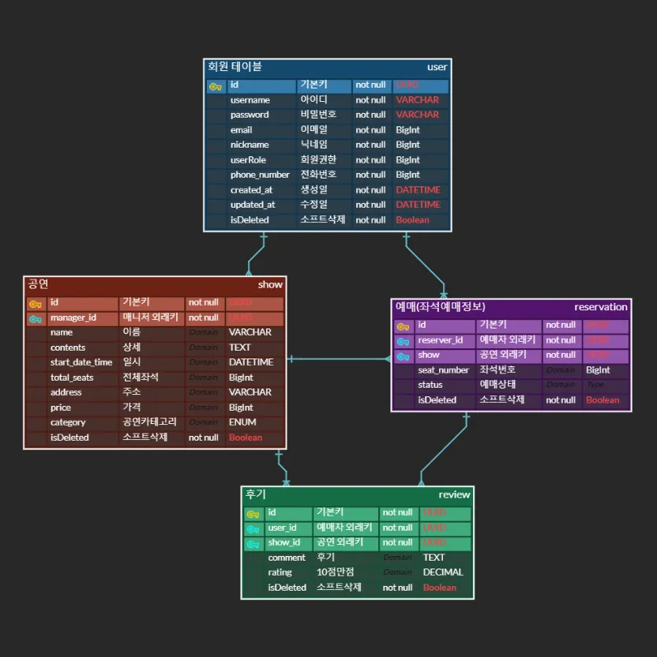

# 🎟️ 인터파티 티켓팅 서비스 (InterParty Ticketing)

---

## 📚 프로젝트 소개

- **진행 기간**: `2024-11-22` ~ `2024-11-29`
- **인터파티 티켓팅 서비스**는 다양한 이벤트(콘서트, 뮤지컬, 스포츠 경기 등)를 위한 티켓팅을 간편하고 안정적으로 제공합니다.
- 특히 **동시성 제어**와 **데이터 정합성**에 중점을 두어, 많은 사용자가 동시에 접속해도 **티켓 예매**와 **좌석 관리**가 정확히 이루어지도록 설계되었습니다.

---

## 👩‍💻 팀원 구성

<div align="center">

|                                          **김혜진**                                          |                                          **이지훈**                                          |                                          **이한식**                                           |                                       **장재혁**                                        |
|:-----------------------------------------------------------------------------------------:|:-----------------------------------------------------------------------------------------:|:------------------------------------------------------------------------------------------:|:------------------------------------------------------------------------------------:|
|  <br/> [@hyejin-kim](https://github.com/shushuaka) |  <br/> [@jihoon-lee](https://github.com/dashboard) |  <br/> [@hansik-lee](https://github.com/coldrice99) |  <br/> [@jaehyuk-jang](jehyuck3443@gmail.com) |

</div>

---

## 🔧 사용한 기술 스택

     

---

## 🧩 프로젝트 설계

### 와이어프레임

- 회원, 예매, 공연, 리뷰 **4개의 도메인**으로 나누어 설계.
- 각 도메인의 와이어프레임은 아래와 같습니다:
- https://www.figma.com/board/RptzfnRuQOECXlDyCO6vZ7/i2-%ED%94%84%EB%A1%9C%EC%A0%9D%ED%8A%B8-figjam?node-id=0-1&node-type=canvas&t=6jYEgJLarpuEZXDn-0
  

---

### ERD (Entity Relationship Diagram)

- 데이터베이스 설계는 아래 ERD를 기반으로 진행되었습니다:
- https://www.erdcloud.com/d/6KgyKo9u38vXQBpSY
  

---

## 📋 API 명세서

- 각 도메인별 CRUD 및 주요 기능을 포함한 API 명세서는 별도로 제공합니다:

## 📋 API 명세서

| **기능**       | **Method**   | **URL**                            | **Request**                                                                                                                                                             | **Response**                                                                                                                                                                  |
|--------------|--------------|------------------------------------|-------------------------------------------------------------------------------------------------------------------------------------------------------------------------|-------------------------------------------------------------------------------------------------------------------------------------------------------------------------------|
| **회원가입**     | POST         | `/api/auth/signup`                 | `{ "username": "coldrice99", "email": "coldrice99@gmail.com", "password": "Password123!", "userRole": "USER", "nickname": "coldrice", "phoneNumber": "010-9999-9999" }` | 회원가입 완료 메시지                                                                                                                                                                   |
| **로그인**      | POST         | `/api/auth/login`                  | `{ "userName": "coldrice99", "password": "Password123!" }`                                                                                                              | Bearer Token 저장                                                                                                                                                               |
| **회원 정보 조회** | GET          | `/api/users`                       | N/A                                                                                                                                                                     | `{ "id": "72de442b-f3a4-4c75-866c...", "username": "coldrice", "email": "coldrice99@gmail.com", "nickname": "coldrice", "userRole": "USER", "phoneNumber": "010-9999-9999" }` |
| **회원 정보 수정** | PATCH        | `/api/users/update`                | `{ "currentPassword": "Password123!", "newPassword": "NewPassword123!", "email": "newemail@gmail.com", "nickname": "수정된 닉네임", "phoneNumber": "010-8888-8888" }`         | 수정 완료 메시지                                                                                                                                                                     |
| **회원 탈퇴**    | DELETE       | `/api/users/signout`               | `{ "password": "Password123!" }`                                                                                                                                        | 탈퇴 완료 메시지                                                                                                                                                                     |
| **공연 등록**    | POST         | `/api/shows`                       | `{"id":1,"managerId":1,"name":"알라딘","contents":"알라딘이 요술램프에서..","startDateTime":"2024:11:22:…","totalSeats":10000,"address":"함경북도","price":12000,"category":"MUSICAL"}   
 `            | 공연 등록 완료 메시지 |
| **공연 전체 조회** | GET          | `/api/shows`                       | `{ "category": MUSICAL, "search": "알라딘", "managedBy": UUID }`                                                                                                           | 공연 목록                                                                                                                                                                         |
| **공연 조회**    | GET          | `/api/shows/{showId}`              | N/A                                                                                                                                                                     | 공연 상세 정보                                                                                                                                                                      |
| **공연 수정**    | PATCH        | `/api/shows/{showId}`              | `{"managerId":1,"name":"알라딘","contents":"알라딘이 요술램프에서..","timedate":"2024:11:22:…","totalSeats":10000,"address":"함경북도","price":12000,"category":"MUSICAL"}               
 `            | 수정 완료 메시지    |
| **공연 삭제**    | DELETE       | `/api/shows/{showId}`              | N/A                                                                                                                                                                     | 삭제 완료 메시지                                                                                                                                                                     |
| **예매하기**     | POST         | `/api/shows/{showId}/reservations` | `{ "seat_number": "좌석번호" }`                                                                                                                                             | 예매 완료 메시지                                                                                                                                                                     |
| **내 예매 조회**  | GET          | `/api/reservations`                | N/A                                                                                                                                                                     | 예매 내역                                                                                                                                                                         |
| **예매 취소**    | DELETE       | `/api/shows/{showId}/reservations` | N/A                                                                                                                                                                     | 취소 완료 메시지                                                                                                                                                                     |
| **리뷰 작성하기**  | POST         | `/api/reviews`                     | `@RequestParam userId: UUID, @RequestParam showId: UUID`                                                                                                                | 리뷰 작성 완료 메시지                                                                                                                                                                  |
| **리뷰 조회**    | GET          | `/api/reviews`                     | N/A                                                                                                                                                                     | 리뷰 목록                                                                                                                                                                         |
| **리뷰 수정**    | PATCH        | `/api/reviews/{reviewId}`          | `@PathVariable reviewId: UUID, @RequestBody dto`                                                                                                                        | 리뷰 수정 완료 메시지                                                                                                                                                                  |
| **리뷰 삭제**    | DELETE       | `/api/reviews/{reviewId}`          | N/A                                                                                                                                                                     | 리뷰 삭제 완료 메시지                                                                                                                                                                  |

---

## 📂 프로젝트 구조

```
interparty
├── build.gradle                   # Gradle 설정 파일
├── .idea/                         # IntelliJ IDEA 설정 폴더
├── .gradle/                       # Gradle 캐시 폴더
├── src/
│   ├── main/
│   │   ├── kotlin/
│   │   │   └── com.sparta.interparty
│   │   │       ├── domain         # 주요 도메인별 로직 관리
│   │   │       │   ├── auth       # 인증 및 로그인 관련 로직
│   │   │       │   ├── reservation# 예매 관련 로직
│   │   │       │   ├── review     # 리뷰 관련 로직
│   │   │       │   ├── show       # 공연 관련 로직
│   │   │       │   └── user       # 회원 관련 로직
│   │   │       └── global         # 공통 로직 및 설정
│   │   │           ├── config     # 설정 파일 관리
│   │   │           ├── controller # 공통 컨트롤러
│   │   │           ├── entity     # 공통 엔티티 관리
│   │   │           ├── exception  # 예외 처리
│   │   │           ├── redis      # Redis 관련 로직
│   │   │           ├── security   # 보안 관련 설정
│   │   │           └── util       # 유틸리티 클래스
│   │   └── resources/
│   │       ├── static/            # 정적 리소스 폴더
│   │       ├── application.yml    # Spring Boot 기본 설정 파일
│   │       ├── application-prod.yml  # 프로덕션 환경 설정 파일
│   │       └── application-test.yml  # 테스트 환경 설정 파일
│   └── test/
│       ├── kotlin/
│       │   └── com.sparta.interparty
│       │       ├── domain         # 도메인별 테스트 코드
│       │       └── global         # 공통 로직 테스트 코드
│       │       └── InterpartyApplicationTests.kt  # 통합 테스트 파일
│       └── resources/
│           
```

---

## 👩‍🏭 역할 분담

| **역할**          | **팀원**   |
|-----------------|----------|
| **회원 CRUD**     | 이한식      |
| **예매 CRUD**     | 이지훈      |
| **공연 CRUD**     | 장재혁      |
| **리뷰 CRUD**     | 김혜진      |
| **동시성 제어**      | 김혜진, 장재혁 |
| **Redis 캐싱 구현** | 이한식, 이지훈 |

---

## 🛠️ 기능 설명

### CRUD 설명

- **회원**: 회원가입, 로그인, 회원 정보 수정 및 삭제.
- **공연**: 공연 등록, 수정, 삭제 및 조회.
- **예매**: 좌석 선택 및 예매 관리.
- **리뷰**: 리뷰 작성, 수정, 삭제 및 조회.

### TODO : 동시성 제어 구현 기능 설명

### Redis 캐싱 구현

**Redis를 활용한 조회수 및 랭킹 관리**

- 공연 엔티티에 **조회수**와 **랭킹** 필드 추가.
- 조회수는 Redis에서 관리하며, MySQL과의 동기화는 **1시간 간격 스케줄러**로 처리.
- 랭킹은 매일 자정, Redis의 **Sorted Set 자료구조**를 활용해 상위 5개 공연을 선정 후 MySQL에 저장.

**조회수 초기화 전략**

- 매일 자정 Redis에 저장된 조회수를 초기화.
- 스케줄러 기반 방식 채택. TTL 기반 자동 삭제는 데이터 손실 위험으로 제외.

**어뷰징 방지 로직**

- Redis의 **Set 자료구조**로 유저별 중복 조회 관리.
- 조회수가 **10회 초과 시 어뷰징 감지** 및 차단 로직 적용.

---

## TODO : 동시성제어 테스트 결과

---

## 📊 캐싱 성능 분석

### 문제의 배경

기존의 공연 조회 API, **V1**은 데이터베이스에서 직접 데이터를 가져오는 방식으로 구현되어 있었습니다.  
이 방식은 데이터량이 많아질수록 **응답 속도가 느려지는 문제**가 발생하였습니다.  
이를 해결하기 위해 **Redis 캐싱**을 활용한 새로운 API, **V2**를 설계하였습니다.  
목표는 **성능을 개선**하고, 더 많은 데이터를 **효율적으로 처리**하는 것이었습니다.

---

### 테스트 환경

- **공연 데이터**: 10,000개 설정
- **테스트 도구**: Postman Runner
- **테스트 시나리오**: 유저가 10,000개의 공연 데이터를 조회 요청
- **비교 조건**: 동일한 조건에서 V1과 V2 API의 성능을 테스트

---

### 테스트 결과

| **지표**             | **공연 조회 V1** | **공연 조회 V2** | **차이**          |
|----------------------|------------------|------------------|-------------------|
| **평균 응답 시간**   | 315ms           | 110ms           | **65% 향상**      |
| **90% 응답 시간**    | 513ms           | 57ms            | **89% 향상**      |
| **최대 응답 시간**   | 4,425ms         | 4,379ms         | 거의 동일         |

---

### 분석 결과

- **평균 응답 시간**: V2 API는 V1 API 대비 약 **65% 빠른 응답 속도**를 보였습니다.
- **90% 응답 시간**: V1의 **513ms**에 비해, V2는 **57ms**로 약 **89% 개선**된 결과를 나타냈습니다.
- **최대 응답 시간**: 두 API 간 큰 차이는 없었지만, V2는 더 일관된 성능을 보여주었습니다.

---

### 결론

- Redis 캐싱을 활용한 V2는 데이터량이 많아질수록 **성능 개선 효과**가 두드러졌습니다.
- V2는 데이터베이스로의 직접 접근을 줄이고, **서버 자원을 효율적으로 활용**하여 성능과 안정성을 모두 향상시켰습니다.
- 평균 응답 시간과 안정성 측면에서 **V1 대비 확실한 우위**를 보여, 성능 개선 목표를 성공적으로 달성하였습니다.

---

## 🎯 TODO : 개선 목표

(추후 작성 예정)

---

## 📢 TODO : 프로젝트 후기


